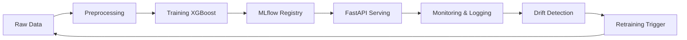

# 🛡️ Credit Card Fraud Detection - MLOps Pipeline

A production-ready machine learning system for real-time credit card fraud detection, built with complete MLOps practices including automated training, deployment, monitoring.

[](https://www.python.org/downloads/)
[](https://opensource.org/licenses/MIT)
[](https://github.com/psf/black)

## 📋 Table of Contents

- [Overview](#-overview)
- [Features](#-features)
- [Architecture](#️-architecture)
- [Dataset](#-dataset)
- [Tech Stack](#️-tech-stack)
- [Getting Started](#-getting-started)
- [Usage](#-usage)
- [Model Performance](#-model-performance)
- [Monitoring & Drift Detection](#-monitoring--drift-detection)
- [API Documentation](#-api-documentation)
- [CI/CD Pipeline](#-cicd-pipeline)
- [Docker Deployment](#-docker-deployment)
- [Future Improvements](#-future-improvements)
- [License](#-license)

## 🎯 Overview

This project demonstrates a complete MLOps pipeline for fraud detection, going beyond simple model training to include:

✅ Automated data preprocessing and versioning  
✅ Experiment tracking with MLflow  
✅ RESTful API for real-time predictions  
✅ CI/CD pipelines with GitHub Actions  
✅ Automated testing and code quality checks  
✅ Model monitoring and Drift detection
✅ Scheduled retraining workflows  
✅ Docker containerization  

**Business Value:** Detects fraudulent credit card transactions in real-time with 97%+ accuracy, reducing financial losses and protecting customers.

## ✨ Features

### 🤖 Machine Learning

- **Imbalanced Learning:** SMOTE oversampling to handle class imbalance (0.17% fraud rate)
- **Model:** XGBoost classifier optimized for fraud detection
- **Metrics:** ROC-AUC score of 0.97+ on test set
- **Experiment Tracking:** Complete MLflow integration for reproducibility

### 🚀 MLOps & Production

- **API Serving:** FastAPI endpoint for real-time predictions (<100ms latency)
- **Containerization:** Docker support for consistent deployment
- **CI/CD:** Automated testing and deployment on every commit
- **Monitoring:** Prediction logging and drift detection with Evidently AI
- **Auto-Retraining:** Weekly scheduled retraining to maintain model performance

### 🧪 Software Engineering

- **Testing:** Comprehensive test suite with pytest (70%+ coverage)
- **Code Quality:** Automated linting with flake8 and formatting with black
- **Documentation:** Complete API docs with OpenAPI/Swagger
- **Version Control:** Git for code, DVC for data versioning

## 🏗️ Architecture


```mermaid
graph LR
    A[Raw Data] --> B[Preprocessing]
    B --> C[Training XGBoost]
    C --> D[MLflow Registry]
    D --> E[FastAPI Serving]
    E --> F[Monitoring & Logging]
    F --> G[Drift Detection]
    G --> H[Retraining Trigger]
    H --> A
```

## 📊 Dataset

**Source:** [Kaggle Credit Card Fraud Detection](https://www.kaggle.com/datasets/mlg-ulb/creditcardfraud)

**Description:**
- 284,807 transactions over 2 days
- 492 fraudulent transactions (0.172% of total)
- 30 features: 28 PCA-transformed features (V1-V28), Time, Amount
- Highly imbalanced: Requires special handling techniques

**Key Statistics:**

| Metric | Value |
|--------|-------|
| Total Transactions | 284,807 |
| Fraud Cases | 492 (0.17%) |
| Normal Cases | 284,315 (99.83%) |
| Features | 30 |
| Train/Test Split | 80/20 |

## 🛠️ Tech Stack

### Core ML & Data Science

- **Python 3.10** - Programming language
- **pandas, numpy** - Data manipulation
- **scikit-learn** - ML utilities and preprocessing
- **XGBoost** - Gradient boosting model
- **imbalanced-learn** - SMOTE for class balancing

### MLOps & Experiment Tracking

- **MLflow** - Experiment tracking and model registry
- **DVC** - Data version control
- **Evidently AI** - Model monitoring and drift detection

### API & Deployment

- **FastAPI** - REST API framework
- **Uvicorn** - ASGI server
- **Docker** - Containerization
- **Pydantic** - Data validation

### CI/CD & Testing

- **GitHub Actions** - CI/CD pipelines
- **pytest** - Testing framework
- **pytest-cov** - Code coverage
- **flake8** - Code linting
- **black** - Code formatting

## 🚀 Getting Started

### Prerequisites

- Python 3.10+
- Git
- (Optional) Docker
- (Optional) Kaggle API credentials

### Installation

#### 1. Clone the Repository

```bash
git clone https://github.com/NTRajapaksha/fraud_detection-mlops.git
cd fraud_detection-mlops
```

#### 2. Set Up Python Environment

```bash
# Create virtual environment
python -m venv venv

# Activate virtual environment
# On Linux/Mac:
source venv/bin/activate
# On Windows:
venv\Scripts\activate

# Install dependencies
pip install -r requirements.txt
```

#### 3. Download Dataset

**Option A: Using Kaggle API (Recommended)**

```bash
# Set up Kaggle credentials
mkdir ~/.kaggle
echo '{"username":"YOUR_USERNAME","key":"YOUR_API_KEY"}' > ~/.kaggle/kaggle.json
chmod 600 ~/.kaggle/kaggle.json

# Download dataset
kaggle datasets download -d mlg-ulb/creditcardfraud -p data/raw --unzip
```

**Option B: Manual Download**

1. Go to [Kaggle Dataset Page](https://www.kaggle.com/datasets/mlg-ulb/creditcardfraud)
2. Download `creditcard.csv`
3. Place in `data/raw/` directory

#### 4. Initialize DVC

```bash
dvc init
dvc add data/raw/creditcard.csv
git add data/raw/.gitignore data/raw/creditcard.csv.dvc
git commit -m "Add dataset with DVC"
```

## 💻 Usage

### 1. Train the Model

```bash
# Run complete training pipeline
python src/models/train.py
```

**Output:**
```
INFO: Training pipeline started...
INFO: Data preprocessed successfully
INFO: Model training complete
INFO: Metrics - ROC-AUC: 0.9745, F1-Score: 0.50
INFO: Model saved to MLflow
```

### 2. Start MLflow UI (Optional)

```bash
# View experiments and models
mlflow ui --host 0.0.0.0 --port 5000
```

Access at: `http://localhost:5000`

### 3. Start the API Server

```bash
# Start FastAPI server
uvicorn src.api.main:app --reload --host 0.0.0.0 --port 8000
```

**Server Output:**
```
INFO:     Uvicorn running on http://0.0.0.0:8000
✓ Loaded model from: mlruns/.../artifacts/fraud_detection_pipeline
INFO:     Application startup complete.
```

### 4. Make Predictions

**Using curl:**

```bash
curl -X POST "http://localhost:8000/predict" \
  -H "Content-Type: application/json" \
  -d '{
    "features": [-1.359807134, -0.072781173, 2.536346738, 1.378155224,
                 -0.338320770, 0.462387778, 0.239598554, 0.098697901,
                 0.363786970, 0.090794172, -0.551599533, -0.617800856,
                 -0.991389847, -0.311169354, 1.468176972, -0.470400525,
                 0.207971242, 0.025790590, 0.403992960, 0.251412098,
                 -0.018306778, 0.277837576, -0.110473910, 0.066928075,
                 0.128539358, -0.189114844, 0.133558377, -0.021053053,
                 149.62, 0.0]
  }'
```

**Response:**
```json
{
  "is_fraud": false,
  "fraud_probability": 0.00045047939056530595,
  "confidence": 0.9995495080947876
}
```

### 5. Interactive API Documentation

Access Swagger UI at: `http://localhost:8000/docs`

## 📈 Model Performance

### Metrics on Test Set

| Metric | Value |
|--------|-------|
| ROC-AUC | 0.9737645603401743 |
| F1-Score (Fraud) | 0.5044510385756676 |

## 📊 Monitoring & Drift Detection

The system includes automated monitoring to ensure model performance:

- **Prediction Logging:** All predictions logged for analysis
- **Drift Detection:** Evidently AI monitors feature and target drift
- **Performance Tracking:** Key metrics tracked over time
- **Alert System:** Automated alerts for performance degradation

Simulate Production Traffic Generates synthetic transaction data. Some data simulates "normal" behavior, and some simulates "drifted" behavior (high values/anomalies)
```bash
python src/data/simulate_traffic.py
```
Detect Data Drift Compares the "Reference" data with "Current" data. Logs a visual HTML report to MLflow.
```bash
python src/models/monitor.py
```

## 🔌 API Documentation

### Base URL
```
http://localhost:8000
```

### Endpoints

#### 1. Health Check
```http
GET /health
```

**Response:**
```json
{
  "status": "healthy",
  "model_loaded": true
}
```

#### 2. Predict

```http
POST /predict
```

**Request Body:**
```json
{
  "features": [float] * 30  // Array of 30 numerical features
}
```

**Response:**
```json
{
  "is_fraud": boolean,
  "fraud_probability": float,
  "confidence": float
}
```

## 🔄 CI/CD Pipeline

### Continuous Integration (`.github/workflows/ci.yml`)

**Triggers:** Push to `main`, Pull Requests

**Steps:**
1. **Setup Environment** - Python 3.10
2. **Install Dependencies** - `pip install -r requirements.txt`
3. **Run Tests** - `pytest tests/ -v --cov`
4. **Code Linting** - `flake8 src/`
5. **Code Formatting** - `black --check src/`

### Scheduled Retraining (`.github/workflows/retrain.yml`)

**Triggers:** Weekly (Sunday at 00:00 UTC)

**Steps:**
1. Download latest data
2. Retrain model
3. Evaluate performance
4. Update model registry if improved

## 🐳 Docker Deployment

### Build Image

```bash
docker build -t fraud-detection:latest .
```

### Run Container

```bash
docker run \
  -p 8000:8000 \
  -v $(pwd):/workspaces/fraud_detection-mlops \
  fraud-detection:latest
```

### Test Container

```bash
curl http://localhost:8000/health
```

## 🔍 Codebase Walkthrough: What Happens in Each File

### 1. Data Processing & Modeling
**`src/data/preprocessing.py`**
- **Purpose:** Prepares the raw data for machine learning.
- **What it does:** It loads the massive CSV file, performs a stratified split (ensuring the rare 0.17% fraud cases are distributed evenly between train and test sets), and saves the outputs in `.parquet` format.

**`src/models/train.py`**
- **Purpose:** The core model training script.
- **What it does:** It pulls the Parquet files and initializes an MLflow experiment. It creates a robust pipeline: `StandardScaler -> SMOTE -> XGBoost`. After training, it evaluates the model (ROC-AUC and F1 scores), logs these metrics to MLflow, and registers the final pipeline artifact. It also saves the `X_test` data as `reference_data.csv` for future drift monitoring.

### 2. Model Monitoring
**`src/models/monitor.py`**
- **Purpose:** Automatically detects if the live data is shifting away from what the model learned.
- **What it does:** It loads the `reference_data.csv` (from training) and a `current_data.csv` (representing recent live traffic). It runs an Evidently AI `DataDriftPreset` report, which runs statistical tests on every feature column. It logs the percentage of drifted columns to MLflow and saves a rich HTML report containing visual charts of the drift.

### 3. Real-Time Serving
**`src/api/main.py`**
- **Purpose:** The customer-facing (or backend-facing) application that serves the AI predictions.
- **What it does:** A FastAPI application. During startup, it reaches out to the MLflow model registry and loads the production version of the fraud model into RAM. It exposes a `POST /predict` endpoint that accepts 30 transaction features. It instantly pushes these features through the loaded pipeline, determines if the transaction is fraudulent, and returns the AI's confidence percentage.

### 4. DevOps & Automation
**`.github/workflows/ci.yml`**
- **Purpose:** The automated guardrails for the codebase.
- **What it does:** Every time a developer pushes code to the repository, GitHub automatically spins up a server, installs Python, runs `ruff` to ensure the code is styled correctly (linting), and runs `pytest` to ensure no changes broke the underlying logic of the application.

---

## 🔮 Future Improvements

- [ ] Add authentication/API keys for security
- [ ] Implement A/B testing for model versions
- [ ] Create Grafana dashboards for monitoring
- [ ] Deploy to AWS/GCP/Azure
- [ ] Implement feature store (Feast)
- [ ] Add explainability tools (SHAP, LIME)
- [ ] Real-time streaming with Kafka
- [ ] Kubernetes orchestration
- [ ] Multi-model ensemble
- [ ] Online learning capabilities

## 📄 License

This project is licensed under the MIT License - see the [LICENSE](LICENSE) file for details.

---

## 📬 Contact

**Project Maintainer:** NTRajapaksha

**Repository:** [fraud_detection-mlops](https://github.com/NTRajapaksha/fraud_detection-mlops)

---

⭐ **If you find this project helpful, please consider giving it a star!**
